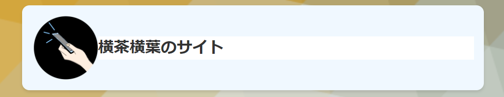
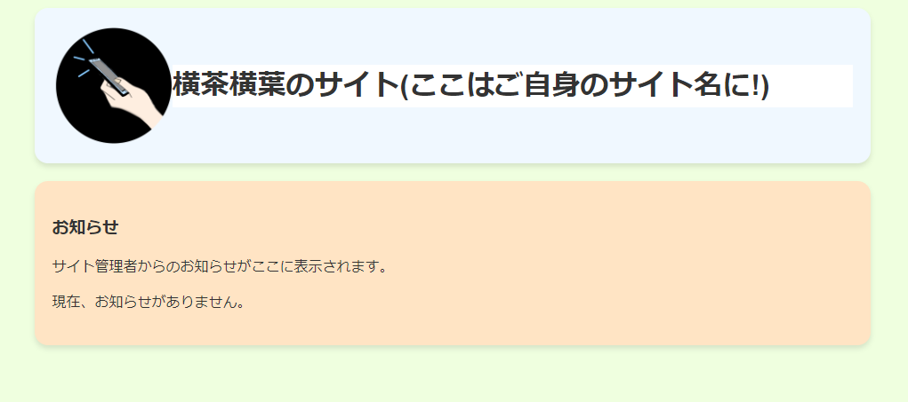

# CoffeeUI_CSS [Experimental]  

どなたでも気軽に利用(流用)できる横茶横葉のサイトのスタイルシートです!  
検証中です...(ベータ版)  
(このリポジトリは予告なしに消滅することがありますので、使用時は直リンクを避け、ご自身のサーバーへアップロードすることをお勧めします。)  
このスタイルシートには横茶横葉Bライセンスが適用されます。  

## 使い方　　
最初のタイトル表示は以下のように設定します(もちろんコピペしてOK!)  
```html:title.html
        <div class="A">
            <div class="title">
                 <!--ここのimg srcは変えてくださいね!-->
                 <h1>横茶横葉のサイト(ここはご自身のサイト名に!)</h1> 
            </div>
       </div>
```
その下からは、div class=B~Hまで用意しています。(Rev.1時点で)  
以下のように  
```html:contents.html
        <div class="C"> <!--この部分の"C"をB~Hまで指定することで色を変えることができます。-->
<h3>お知らせ</h3>
<p>サイト管理者からのお知らせがここに表示されます。</p><!--使用例です-->
<p>現在、お知らせがありません。</p>
</div>
```
すれば、CSSが適用できます。  
実装例  
  
横茶横葉のサイトでは一部改変されていますが、フルに使っています。  
活用例1:https://yokochayokoha.github.io  
活用例2:https://yokochayokoha.github.io/anzu
## チートシート  
楽がしたい方のためにチートシートをご用意しました。コピペして御利用下さい!(未検証。間違いあるかも..)  

### 1.CSS適用(ご自身のサーバーにアップしてから貼り付けます。ルートディレクトリに配置!)  
Rev.1版  
```
<link href="cuirev1.css" rel="stylesheeet"/>
```

### 2.タイトル表示  
```
<div class="A">  
<div class="title">  
  
<h1></h1>   
 </div>  
 </div>  
```
### 3.B~Hまでのdiv  
```
<div class="B">  
</div> 

<br>

<div class="C">  
</div>  

<br>

<div class="D">  
</div>  

<br>

<div class="E">  
</div>  

<br>

<div class="F">  
</div>  

<br>

<div class="G">  
</div>  

<br>

<div class="H">  
</div>
```
